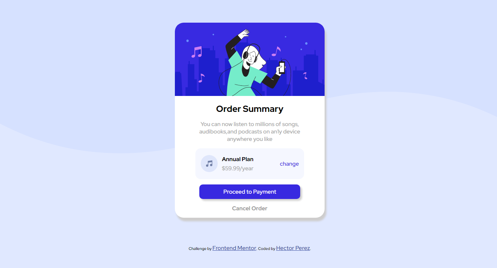

# Frontend Mentor - Order summary card solution

This is a solution to the [Order summary card challenge on Frontend Mentor](https://www.frontendmentor.io/challenges/order-summary-component-QlPmajDUj). Frontend Mentor challenges help you improve your coding skills by building realistic projects.

## Table of contents

-   [Overview](#overview)
    -   [The challenge](#the-challenge)
    -   [Screenshot](#screenshot)
    -   [Links](#links)
-   [My process](#my-process)
    -   [Built with](#built-with)
    -   [What I learned](#what-i-learned)
    -   [Continued development](#continued-development)
    -   [Useful resources](#useful-resources)
-   [Author](#author)
-   [Acknowledgments](#acknowledgments)

**Note: Delete this note and update the table of contents based on what sections you keep.**

## Overview

### The challenge

Users should be able to:

-   See hover states for interactive elements

### screenshot



### Links

-   Solution URL: [The project repository](https://github.com/hectorRperez/challenge-1-order-summary-component)
-   Live Site URL: [Add live site URL here](https://hectorrperez.github.io/challenge-1-order-summary-component/)

## My process

### Built with

-   Semantic HTML5 markup
-   CSS custom properties
-   Flexbox

### What I learned

-   In this project I realized that I should continue to practice flex box
-   I need to work better with html semantic tags
-   I need to practice the background property, for example I don't know very well how to position images correctly. To work with the class below it cost me a lot

```css
.body {
	background: url(images/pattern-background-desktop.svg) no-repeat var(--primary);
}
```

-   I still have trouble working with the mobil

## Author

-   Website - [My portafolio](https://hectorrperez.github.io/portafolio_hector/m)
-   Frontend Mentor - [Frontend Mentor user](https://www.frontendmentor.io/profile/hectorRperez)
-   Twitter - [@yourusername](https://twitter.com/hectorPerezDev)
